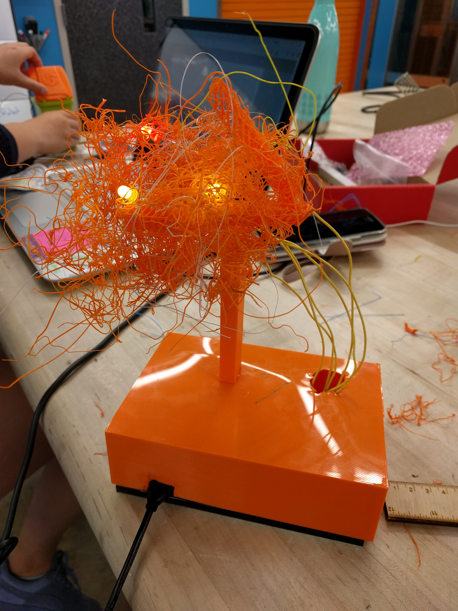
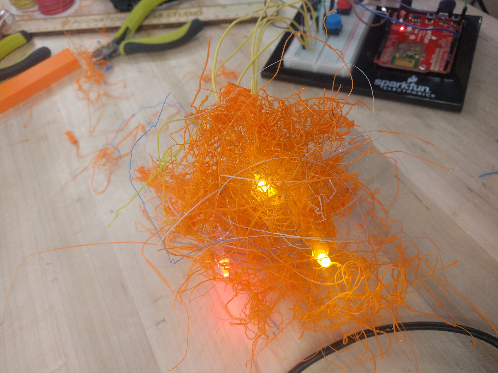
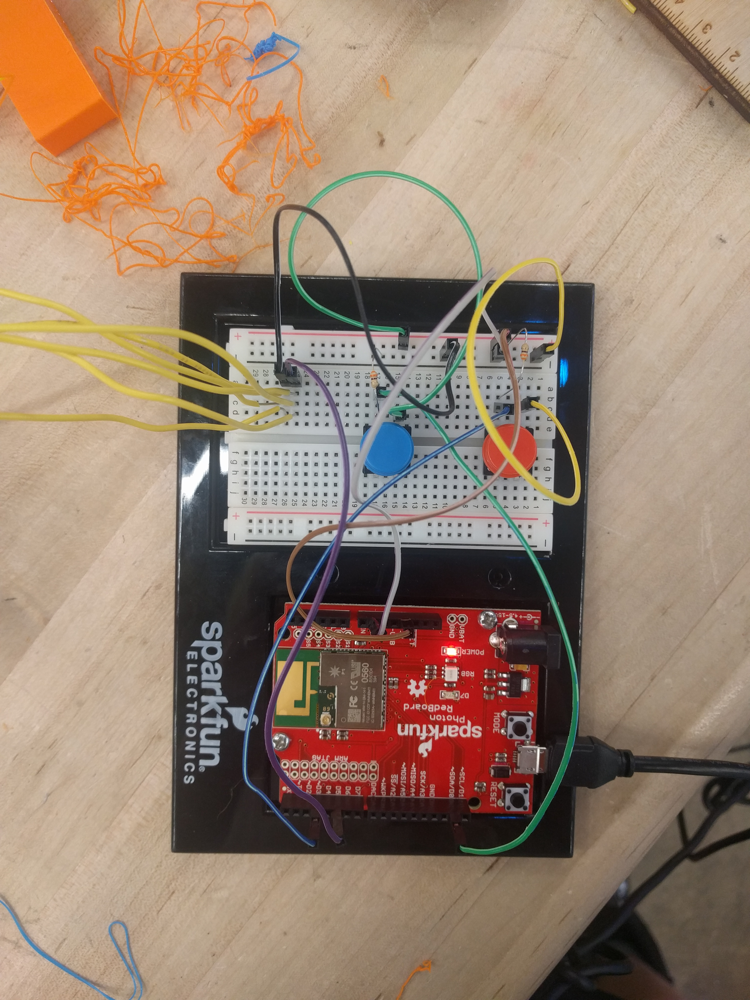

# Midterm IoT Project

Name:  PATRICIA TORVALDS pmt / pmt15

Date: 10.11.17

## Project: TRASH CLOUDS

### Conceptual Description

My project in conjunction with @tracylooloo engages in the ideas of e-waste. While Tracy Lu's project is a trash can, mine represents the physical fallout of electronic waste in the form of a "toxic cloud"/"trash cloud" actually made of 3D printer scraps. The trash cloud is filled with red and yellow LED lights which turn on when either someone presses the button on my piece, or when someone removes the lid of Tracy's trash can. Often, software users end their interactions with so-called trash at the end of an electronic's lifespan; my piece extends that lifespan and makes trash visible.
### Form

My piece is, importantly, largely mad from "trash." The orange smokestack supporting the toxic cloud was found abandoned in the CoLab. The trash cloud itself is made of 3D printed refuse. While this piece may look strange in its final form, the materials used to produce it are part of the message. The industrial looking plastic box is reminiscent of both a factory setting and factory-produced goods, while the bright oranges, reds, and yellows lend an unnatural glow to the piece even when the LEDs are off.

**Finished Enclosure:**



**Electronics Exposed:**





### Technical Details
//   
Here you should give an overview of the technical operation of your device, including:
* A wiring diagram
* list of hardware used
* Explanation of your
* Link to code   

//

You can include code snippets here:

```
Particle.subscribe("Execute", messageParse, MY_DEVICES);
```

but also link to your project's full code in this repository:  [photon.ino](photon.ino)

**Wiring Diagram**


